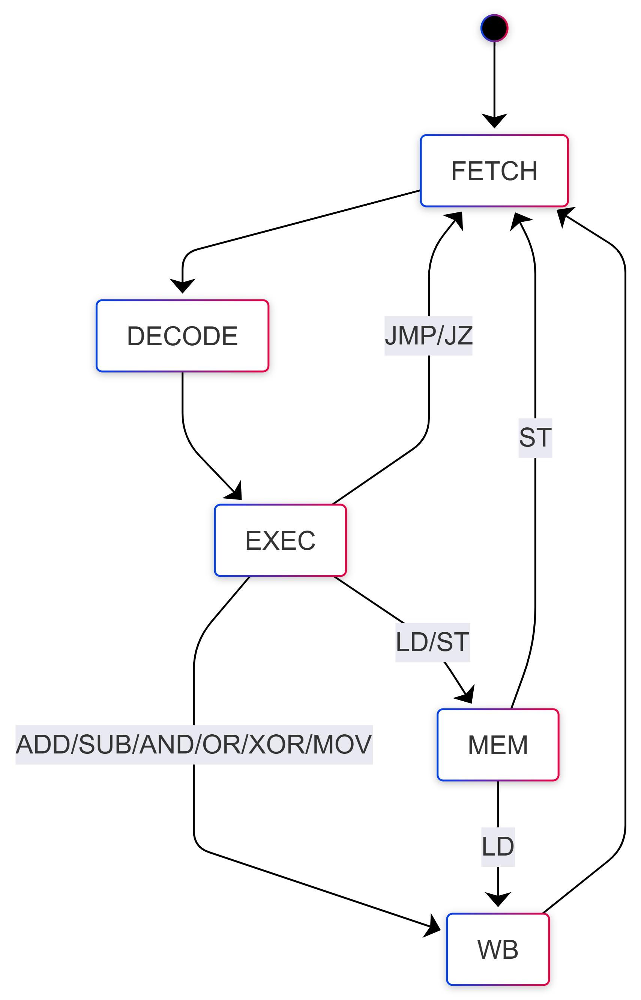
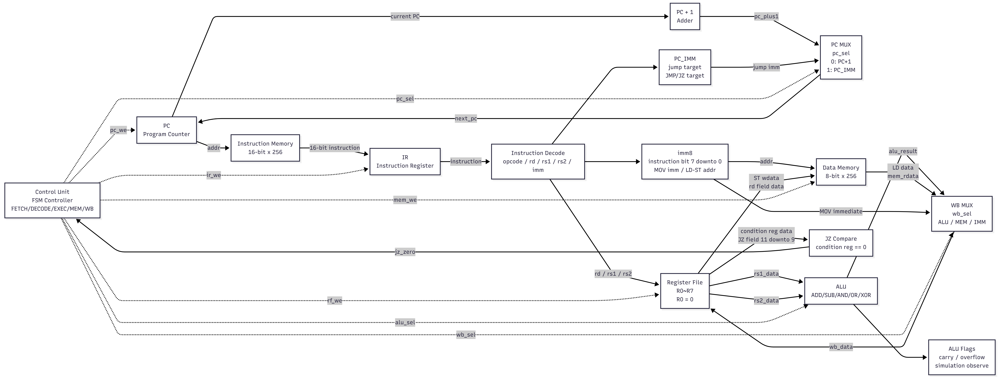
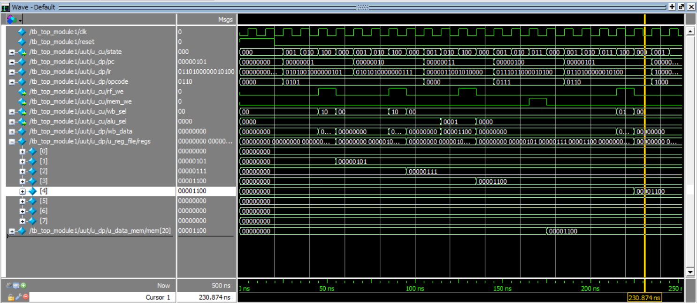
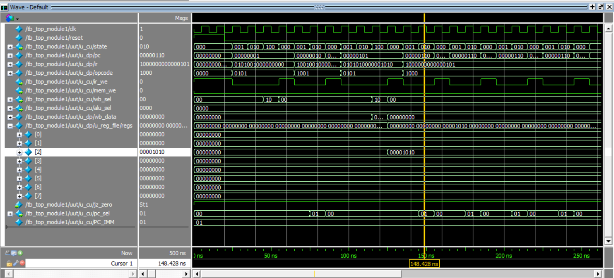
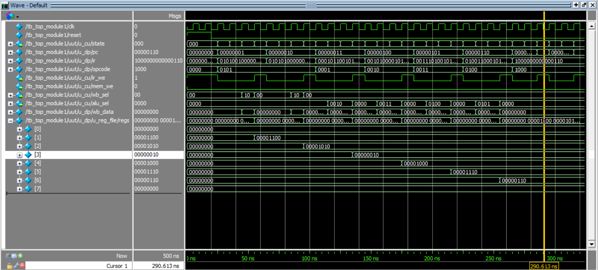

# Verilog HDL 기반 8-bit Multi-cycle CPU 설계

## 1. 프로젝트 개요

본 프로젝트는 Verilog HDL을 사용하여 8-bit Multi-cycle CPU를 설계하고,  
ModelSim 시뮬레이션을 통해 기능을 검증한 RTL 설계 프로젝트입니다.

ISA 직접 정의부터 Control Unit(FSM), Datapath 설계, 시뮬레이션 검증까지  
전 과정을 직접 수행하였습니다.

CPU는 크게 두 부분으로 구성됩니다.

- `Control Unit` : FSM 기반으로 제어 신호 생성
- `Datapath` : 데이터 이동, ALU 연산, 메모리 접근, write-back 수행

> 본 프로젝트는 학습용 CPU 설계 프로젝트입니다.  
> Pipeline, cache, interrupt, AXI/APB bus interface, FPGA board-level 검증 등  
> 고급 기능은 현재 버전에 포함되어 있지 않습니다.

---

## 2. CPU 기본 사양

| 항목 | 설명 |
|---|---|
| Data Width | 8-bit |
| Instruction Width | 16-bit |
| Register File | R0~R7 (R0 hardwired zero) |
| PC Width | 8-bit |
| Instruction Memory | 16-bit x 256 (ROM) |
| Data Memory | 8-bit x 256 (RAM) |
| Control Type | FSM 기반 Multi-cycle |
| Simulation Tool | ModelSim Intel FPGA Edition 2020.1 |

---

## 3. 지원 명령어 (ISA)

| Opcode | Instruction | Type | Operation |
|---|---|---|---|
| `4'h0` | ADD | R-type | `rd = rs1 + rs2` |
| `4'h1` | SUB | R-type | `rd = rs1 - rs2` |
| `4'h2` | AND | R-type | `rd = rs1 & rs2` |
| `4'h3` | OR  | R-type | `rd = rs1 \| rs2` |
| `4'h4` | XOR | R-type | `rd = rs1 ^ rs2` |
| `4'h5` | MOV | I-type | `rd = imm8` |
| `4'h6` | LD  | I-type | `rd = data_mem[imm8]` |
| `4'h7` | ST  | I-type | `data_mem[imm8] = rd` |
| `4'h8` | JMP | J-type | `PC = imm8` |
| `4'h9` | JZ  | JZ-type | `if (rs1 == 0) PC = imm8` |

명령어 포맷 상세는 [ISA Specification](doc/isa.md)을 참고하세요.

---

## 4. 아키텍처

### FSM 상태 전이

Control Unit은 5개 상태를 갖는 FSM으로 구현했습니다.

| State | 설명 |
|---|---|
| FETCH | 명령어 fetch 및 PC+1 |
| DECODE | 명령어 해석, 레지스터 읽기 준비 |
| EXEC | ALU 연산 또는 분기 판단 |
| MEM | LD/ST 명령어의 메모리 접근 |
| WB | 결과를 Register File에 write-back |

상태 전이 흐름:

```text
공통:          FETCH → DECODE → EXEC
R-type / MOV:  EXEC → WB → FETCH
LD:            EXEC → MEM → WB → FETCH
ST:            EXEC → MEM → FETCH
JMP / JZ:      EXEC → FETCH
```

JZ는 taken 여부와 관계없이 다음 상태는 FETCH입니다.  
차이는 PC를 immediate target으로 갱신하는지 여부입니다.

```text
JZ taken     : pc_we=1, pc_sel=PC_IMM → PC = imm8
JZ not-taken : pc_we=0 → PC 유지
```

### FSM Diagram



---

### Datapath 구성

| 블록 | 설명 |
|---|---|
| PC | 8-bit Program Counter |
| Instruction Memory | 16-bit ROM, combinational 읽기 |
| IR | Instruction Register |
| Register File | R0~R7, R0 hardwired zero, 비동기 리셋 |
| ALU | ADD/SUB/AND/OR/XOR, Carry/Overflow/Zero 플래그 출력 |
| Data Memory | 8-bit RAM, 동기 쓰기, combinational 읽기 |
| Write-back MUX | ALU result / MEM data / immediate 선택 |
| JZ Compare Logic | `jz_zero = (rs1_data == 0)`, ALU flag와 분리 |

Write-back MUX 선택:

| wb_sel | Source |
|---|---|
| `WB_ALU` | ALU 연산 결과 (ADD/SUB/AND/OR/XOR) |
| `WB_MEM` | Data Memory 읽기 결과 (LD) |
| `WB_IMM` | Immediate 값 (MOV) |

### Datapath Diagram



---

## 5. 검증 결과

ModelSim 시뮬레이션으로 검증하였으며 전체 PASS하였습니다.

### Test 1: 기본 명령어 흐름 (MOV / ADD / ST / LD)

```text
MOV R1, 5
MOV R2, 7
ADD R3, R1, R2
ST  R3, 20
LD  R4, 20
```

| 신호 | 기대값 | 결과 |
|---|---|---|
| R1 | 5 | PASS |
| R2 | 7 | PASS |
| R3 | 12 | PASS |
| data_mem[20] | 12 | PASS |
| R4 | 12 | PASS |



---

### Test 2: JZ Taken (조건 분기)

```text
MOV R1, 0
JZ  R1, 4     // R1=0 → taken, PC=4로 점프
MOV R2, 99    // 스킵되어야 함
MOV R2, 10    // 실행되어야 함
```

| 신호 | 기대값 | 결과 |
|---|---|---|
| R1 | 0 | PASS |
| R2 | 10 (99 아님) | PASS |



---

### Test 3: ALU 연산 (SUB / AND / OR / XOR)

```text
MOV R1, 12
MOV R2, 10
SUB R3, R1, R2
AND R4, R1, R2
OR  R5, R1, R2
XOR R6, R1, R2
```

| 신호 | 기대값 | 결과 |
|---|---|---|
| R3 | 2  | PASS |
| R4 | 8  | PASS |
| R5 | 14 | PASS |
| R6 | 6  | PASS |



---

### 추가 검증 항목

| 항목 | 결과 |
|---|---|
| R0 hardwired-zero (쓰기 시도 무시) | PASS |
| JZ not-taken (조건 불만족 시 점프 안 함) | PASS |
| LD/ST 다중 주소 (mem[30], mem[40]) | PASS |
| ALU carry flag (255+1=0, carry=1) | PASS |
| ALU overflow flag (127+1=128, overflow=1) | PASS |

---

## 6. 디버깅 기록

### 1. WB 단계에서 ALU 결과 미유지 문제

**발견:**  
시뮬레이션 파형에서 MOV는 정상 동작하지만  
ADD 결과가 Register File에 저장되지 않는 현상 발견.

**원인:**  
Combinational ALU는 `alu_sel`이 바뀌면 출력도 즉시 바뀝니다.  
EXEC 단계에서 `alu_sel=ALU_ADD`를 주었지만,  
WB 단계로 전이 시 `alu_sel`이 기본값(0)으로 돌아가  
ALU 출력이 0이 되는 것이 원인이었습니다.

**해결:**  
WB 단계에서도 동일한 `alu_sel`을 유지하도록 수정.

```text
현재 구조:
EXEC: alu_sel 설정
WB:   동일한 alu_sel 유지 → write-back

향후 개선:
EXEC: ALUOut <= alu_result  (파이프라인 레지스터 추가)
WB:   wb_data = ALUOut
```

---

### 2. LD/ST 주소 방식 결정

초기에는 LD/ST 주소를 ALU 결과로 사용할지,  
immediate 값으로 사용할지에 대한 구조적 고민이 있었습니다.

최종적으로 immediate addressing 방식으로 정리했습니다.

```text
data_mem.addr = imm8
```

---

### 3. JZ 조건 판단 방식

ALU zero flag 대신 Register File에서 조건 레지스터 값을  
직접 비교하는 방식으로 구현했습니다.

```text
jz_zero = (rs1_data == 0)
```

이를 통해 branch 조건 판단을 ALU flag와 분리했습니다.

---

## 7. 현재 한계 및 향후 개선 방향

### 현재 한계

본 CPU는 기본 CPU 구조 이해를 목적으로 설계한 학습용 프로젝트입니다.  
아래 기능은 현재 버전에 포함되어 있지 않습니다.

```text
ALUOut / MDR 내부 레지스터
HALT / ADDI / BEQ / BNE 명령어
Status flag register
Pipeline 구조
Cache / Interrupt
Memory-mapped I/O
APB / AXI bus interface
FPGA synthesis 및 timing report
FPGA board-level 검증
```

### 향후 개선 방향

```text
1. 내부 레지스터 추가 (ALUOut, MDR)
   DECODE: A <= rs1_data, B <= rs2_data
   EXEC:   ALUOut <= alu_result
   MEM:    MDR <= data_mem[addr]
   WB:     rd <= ALUOut or MDR

2. 명령어 확장 (HALT, ADDI, BEQ, BNE)
3. Self-checking testbench 작성
4. FPGA synthesis (Vivado / Quartus)
5. APB / AXI-Lite peripheral interface 추가
6. Pipelined CPU 버전 구현
```

---

## 8. 폴더 구조

```text
8bit-multicycle-cpu/
├── rtl/
│   ├── top_module.v
│   ├── control_unit.v
│   ├── datapath.v
│   ├── alu.v
│   ├── register_file.v
│   ├── instr_mem.v
│   └── data_mem.v
├── tb/
│   └── tb_top_module.v
├── doc/
│   ├── isa.md
│   ├── fsm_diagram.png
│   ├── datapath_diagram.png
│   ├── simulation_waveform_test1_basic.png
│   ├── simulation_waveform_test2_jz.png
│   └── simulation_waveform_test3_alu.png
└── README.md
```
